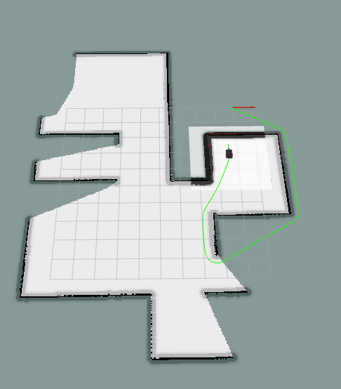

# RT1_Assignment3
# Submitted by Shima Amiri Fard & Supervised by Prof. Carmine Recchiuto

The assignment focuses on the development of a software architecture for the control of a mobile robot. Moreover, the architecture should also be able to fetch the request from the user.It must also allow the user to execute some of the behaviors.

__AIM OF THE ASSIGNMENT__

In this assignment, we need to create a package in which the user will be able to use three different modalities in order to move the robot.The modalities are as follows:

+ autonomously reach a x,y coordinate inserted by the user
+ let the user drive the robot with the keyboard
+ let the user drive the robot assisting them in order to avoid collisions

We proceed in accordance with the instructions given to us beforehand (for example,setting the field goal and position coordinates, etc ) .

__PACKAGES USED__

The two packages responsible for localizing and planning the motion of the robot are `move_base` and `gmapping` packages which are briefly described below :

* The `move_base` package provides an implementation of an *action* that, given a goal in the world, the robot will try to reach it with a mobile base.

* The `gmapping` package contains the algorithm based on a *particle filter* (approach to estimate a probability density) needed for implementing Simultaneous Localization and Mapping (SLAM). Needed by the `gmapping` package. 

The package will be tested on a simulation of a mobile robot driving inside of a given environment. The simulation and visualization are run by the two following programs: 

* **Rviz**: which is a tool for ROS Visualization. Given below is the Rviz environment:



* **Gazebo**: It is a free and open source robot simulation environment. 

Given below is the Gazebo Environmnet:


__INSTALLATION AND SIMULATION__

The project runs on the ROS Noetic environment.

The simulation requires the following steps before running:

* A [ROS Noetic](http://wiki.ros.org/noetic/Installation) installation,

* The download of the `slam_gmapping` package form the *Noetic* branch of the [Professor's repository](https://github.com/CarmineD8/slam_gmapping.git )

Run the following command from the shell:
```bash
git clone https://github.com/CarmineD8/slam_gmapping.git
```

* The download of the **ROS navigation stack** 

Run the following command from the shell:
```bash
sudo apt-get install ros-<your_ros_distro>-navigation
```

* And the and the clone of the [Current repository](https://github.com/shimaamiri/RT1_Assignment3 ). After downloading the repository, you should take the `final_assignment` directory included in the repository and place it inside the local workspace directory.

Run the following command from the shell:
```bash
git clone https://github.com/shimaamiri/RT1_Assignment3
```
Now, run the final commands to launch the platform 
```bash
roslaunch final_assignment simulation_gmapping.launch
```
Run the move.base launch file
```bash
roslaunch final_assignment move_base.launch
```
In order to run the final aspect of the assignment, enter the command in the terminal:
```bash
roslaunch final_assignment final_assignment.launch
```

The *Python* scripts developed define a **user interface** that will let the user switch between driving modalities.

The **three scripts** provided are the following: 

+ achieve_goal.py
+ teleop_avoid.py
+ user_interface.py

__NODES DESCRIPTION__
	
__User Interface__
The user can easily switch bewtween modalities including the one with the idle state. The node is responsible for driving the robot. The user can give the keyboard inputs while interacting.

Driving modalities related to their keyboard inputs are:

 + The following keyboard input [0] resets the current driving modality.
 + The following keyboard input [1] will start the autonomous drive towards a certain location in the map chosen by the user.
 + The following keyboard input [2] is a manual mode without even requiring any assistance.
 + The following keyboard input [3] is a manual mode  but this case requires an assistance.
 + The following keyboard input [4]quits the process.


__Autonomous Driving__

This is the implementation of the __'Autonomous Driving modality'__ feature. The user is asked to insert the __'x'__ and __'y'__ coordinates in which the robot will navigate. If the request cannot be fulfilled within 60 seconds the goal will be cancelled for which a 60 seconds timer is set. The user can also cancel the goal before the time is over, it is sufficient to return to the __'idle'__ status by pressing '0' on the UI console (also shown in the flowchart).

__Manual Driving__

This is the implementation of the Driving with and without assistance. It checks whether there is an obstacle or the path is clear.The user can quit both the modalities by pressing p from the console or by pressing a command on the user-interface.


__FUNCTIONS USED__

The following functions (& callback functions) are used in the goal_reaching.py script

The below Callback function is used to set goal position
```python
def goalpos_callback(v):
	
	global  x_des, y_des, pos_received
	x_des= v.x
	y_des= v.y
	pos_received=True
	
```

The Callback function is used to start the action
```python
def callback_active(): 

	rospy.loginfo("\nAction server is processing the goal...")
```

The main function : It asks the user to insert a given position and therefore sets the goal and action.
```python
	global done_cb
	global target_set
	global isTimeout
	global x_des,y_des
	global pos_received
	
	rospy.init_node('goal_reaching')
	pubTimeout=rospy.Publisher('timeout',Bool,queue_size=10)
	pubModality=rospy.Publisher('mode',Int32,queue_size=10)
	subModality=rospy.Subscriber('mode', Int32,mode_callback)
	subGoalPos=rospy.Subscriber('goalpos', Vector3 , goalpos_callback)
	set_action()
	print (colors.BLUE + colors.UNDERLINE + colors.BOLD +msg1+msg2+colors.ENDC)
	
	while(1):

		if currentmode==1: #if the current mode is '1' i.e. the mode for reaching a goal
			
			if  target_set==False : #if the goal has not been set yet
				
				#print(colors.UNDERLINE + colors.BOLD +"Where do you want the robot to go?"+colors.ENDC)
				#goal_x_coord = float(input(colors.BOLD +"Insert the 'x' coordinate of the goal: "+colors.ENDC))
				#goal_y_coord = float(input(colors.BOLD +"Insert the 'y' coordinate of the goal: "+colors.ENDC))				
				if pos_received:	
					set_target(x_des,y_des)	#set the goal
					target_set = True
					rospy.Timer(rospy.Duration(60),my_clbk_timeout,True)
					pos_received=False
					os.system('cls||clear') #clear the console
			if isTimeout:
				#pubTimeout.publish(True)
				pubModality.publish(0)
				isTimeout=False


		else:	#current mode!=1
			
			if target_set and done_cb==False: #if the goal has been set, the target hasn't been reached yet but the mode has been changed
				client.cancel_goal()
				print (colors.BLUE + colors.UNDERLINE + colors.BOLD +msg1+msg2+colors.ENDC)
			if done_cb: #if the mode has been changed and the task is done
				done_cb=False
			target_set= False
	rate.sleep()
			
```
__FlowChart__


__Conclusion and Improvements__
+ We can clearly see in some of the cases that the robot seems to not choose the best possible path. Hence, there can be a modification where the robot's direction can be manually adjusted while it is autonomously moving.

+ Also,the User Interface could be enhanced for a better user experience.Moreover, the robot can only see within+-90 relative degrees range, so avoiding obstacle while moving backward is a major issues.
 
+ The visual range of the robot can be extended in cases where the robot has passed the goal and needs to turn around in order to reach the position(assuming the goal is behind the robot).


